# An ML-Based Exploration of VIDIMU

Machine-learning experiments built **on top of** the VIDIMU ecosystem — using video + IMU–derived joint angles to recognise daily activities and probe what makes movement recognisable.

> This project **uses** (but does not redistribute) code from **VIDIMU-TOOLS** by Martínez-Zarzuela et al.:  
> https://github.com/twyncoder/vidimu-tools

---

## Overview

Traditional motion-capture systems are accurate but lab-bound and expensive. VIDIMU shows that **affordable video + IMUs** can capture clinically relevant movements in near-natural conditions.  
Here, I focus on an ML pipeline that:
- Extracts time-series features from OpenSim **`.mot`** joint-angle files,
- Visualises activity structure with **PCA**,
- Classifies activities with **Random Forest** under **LOSO** cross-validation,
- Ranks joint-angle features for **interpretability**.

**Dataset (VIDIMU):** 54 participants; 16 with **synchronised video + 5 IMUs**; **13 activities** (e.g., walk forward/backward, walk along a line, sit-to-stand, drink, reach, tear paper, throw/catch).  
Video at 30 fps with single commodity webcam; IMUs at 50 Hz; joint angles from IMUs via **OpenSim**; 3D pose from video via **NVIDIA BodyTrack**; synchronisation provided in the dataset tooling.

---
## Results

### IMU Dataset

**PCA Projection**
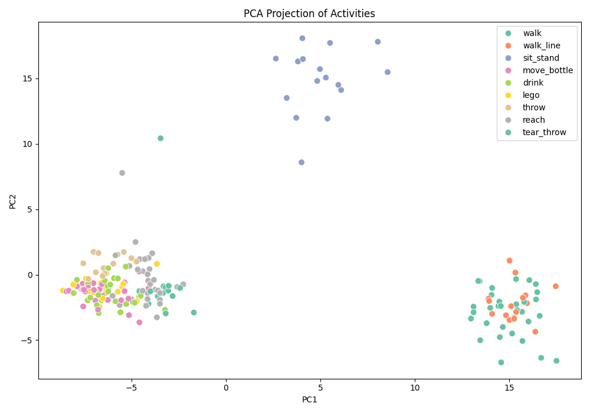

**Random Forest Classification Report**
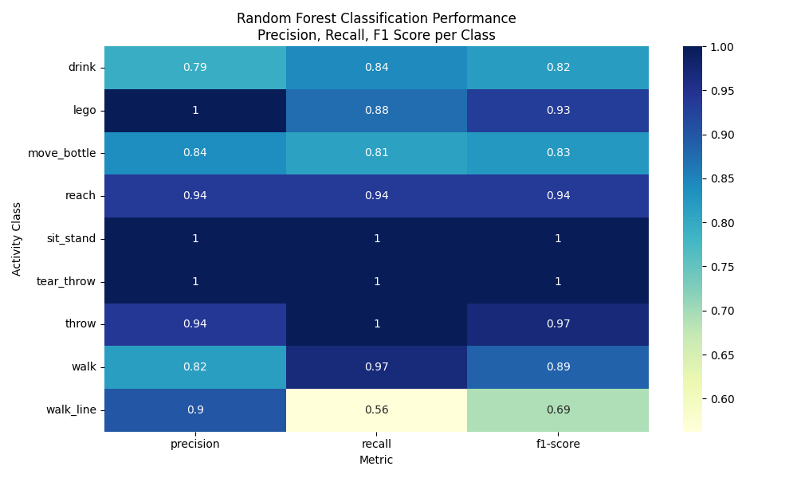

**Confusion Matrix (RF)**
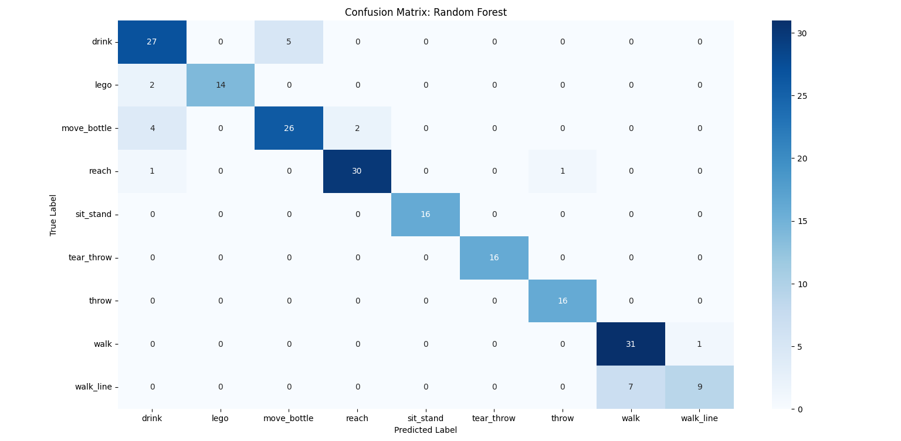

**Top 10 Feature Importances**
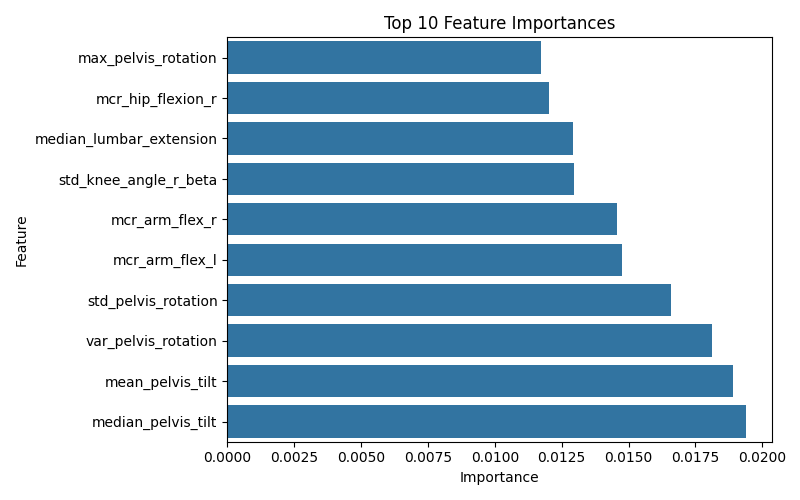


---

### Video Dataset

**PCA Projection**
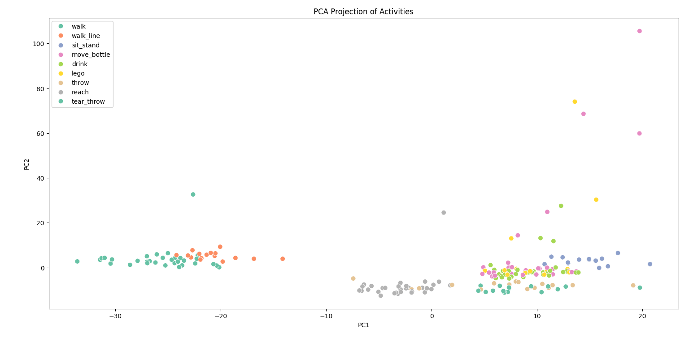

**Classifier Accuracies**
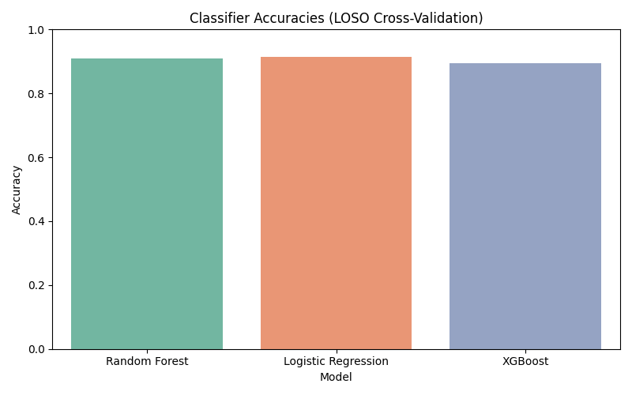

**Confusion Matrix (Logistic Regression)**
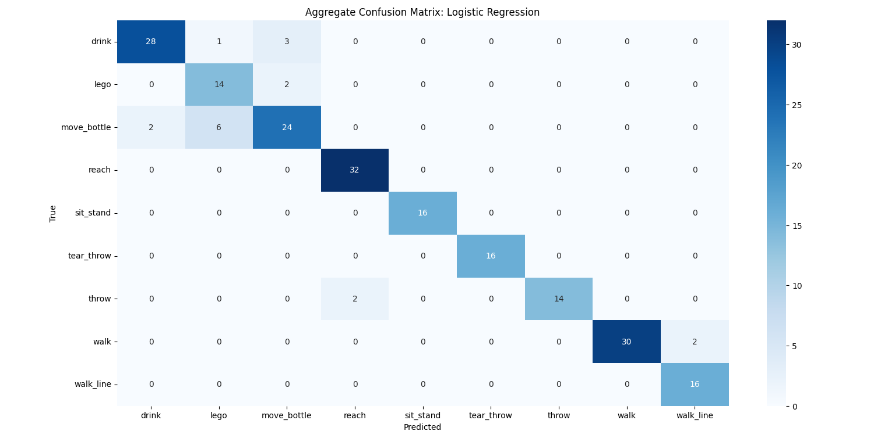

**Confusion Matrix (Random Forest)**
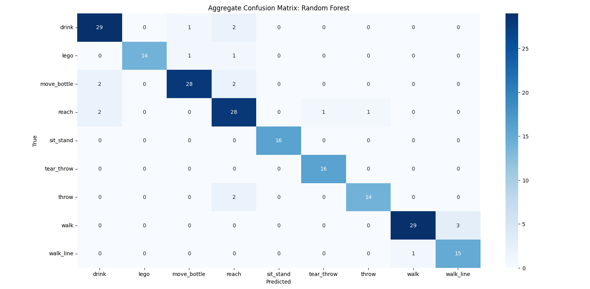

**Confusion Matrix (XGBoost)**
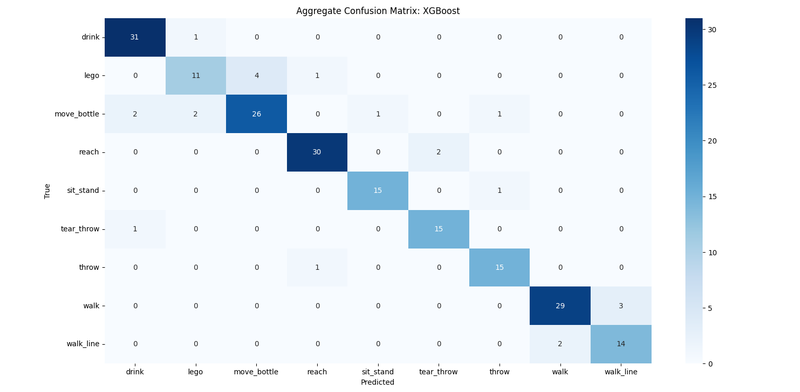

**Feature Importances (Random Forest)**
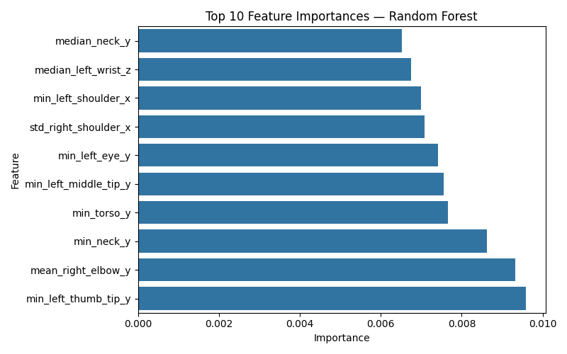

**Feature Importances (XGBoost)**
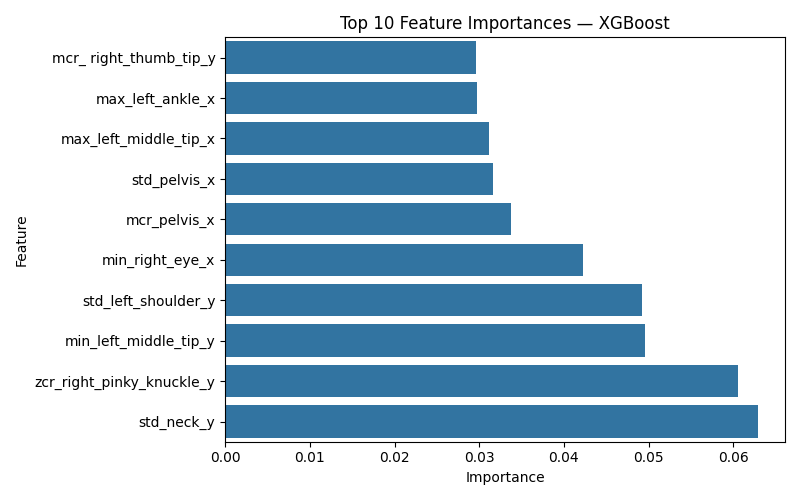

> The ML code here is mine; data preparation steps and several utilities originate from **VIDIMU-TOOLS**.

---

## Repository Structure

This repository is organised as follows:

- **ml/** — My machine learning code and analysis scripts.
  - `machine_learning_IMU.py` — This script processes VIDIMU .mot files, extracts statistical and signal-based features (mean, variance, zero-crossing rate, etc.), merges similar activity labels, and applies Random Forest classification with Leave-One-Subject-Out cross-validation.
  It includes PCA visualisation of feature clusters, performance metrics (accuracy, F1-score), classification report heatmaps, confusion matrices, and top-10 feature importance plots for model interpretability.
  `machine_learning_video_data.py` — This folder contains the machine learning pipeline for the VIDIMU dataset. It loads and preprocesses motion capture .csv files, extracts statistical and signal-based features, merges activity labels, and visualises clusters with PCA. Three classifiers (Random Forest, Logistic Regression, XGBoost) are trained and evaluated using Leave-One-Subject-Out cross-validation. Outputs include accuracy, macro F1-scores, confusion matrices, and feature importance plots for tree-based models.

- **external/vidimu-tools/** *(optional submodule)* — [VIDIMU-TOOLS](https://github.com/twyncoder/vidimu-tools)  
  Original dataset processing code by Martínez-Zarzuela et al., including:
  - **imus/** — IMU quaternion and joint-angle plotting.
  - **video/** — BodyTrack processing and joint-angle plotting from video.
  - **synchronize/** — IMU–video synchronisation notebooks.
  - **utils/** — Auxiliary Python functions for above notebooks.

- **data/** — Place VIDIMU dataset files here (local only; not tracked by Git).

---

## Getting the Data

- VIDIMU dataset: Zenodo record and structure are described in the Scientific Data paper.  
  Joint angles from IMUs are provided as **`.mot`** files (OpenSim) alongside raw/synchronised sources and BodyTrack outputs.

> **Note:** Do **not** commit dataset files to Git. Keep `data/` local and ignored.

---

## Setup

### 1) Clone this repo
```bash
git clone https://github.com/ayushaabbas/vidimu-ml.git
cd vidimu-ml
